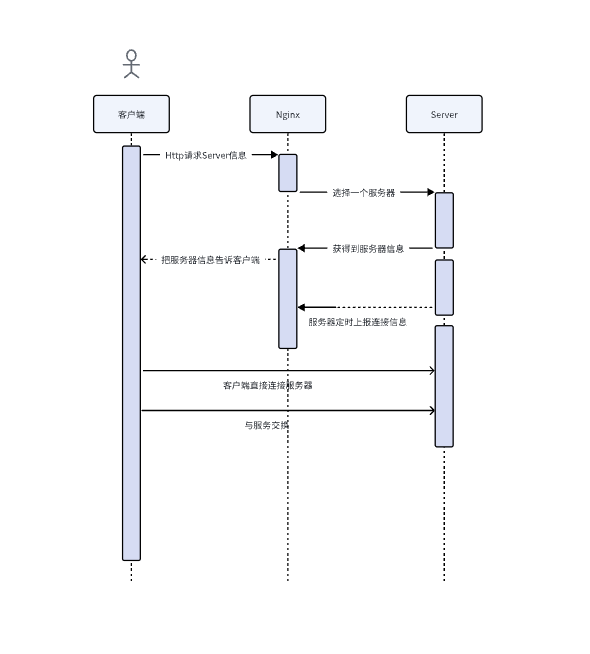

## 主要功能

实现了类似Nginx的负载均衡，

## 功能介绍

1.Client：客户端程序，

2.Nginx：负载负载均衡的http服务器

3.Server：后端服务器

3.Robot：客户端压力测试程序

## 实现流程

1.客户端先发一个http请求给Nginx，收到请求后，筛选合适的内网服务器，把ip和端口返回给客户端
2.客户端拿到Nginx返回的ip和端口，连接后端服务器

## 效果演示
  
